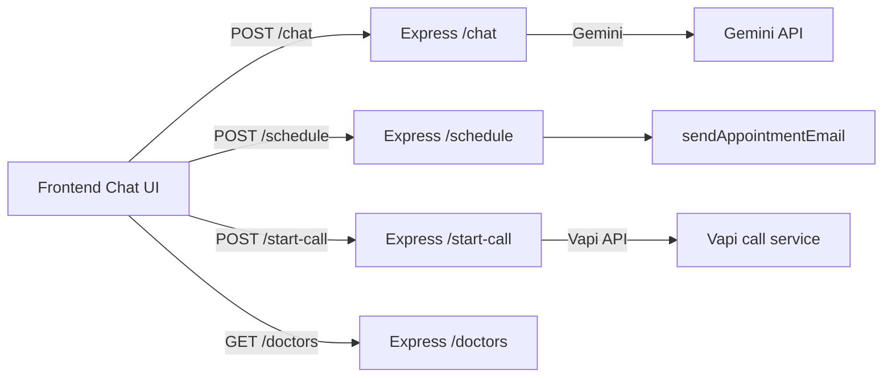

# 🚀 AI Healthcare Scheduling Assistant (Kyron Medical)

A clean technical MVP demonstrating an AI receptionist with voice call continuation.

**Core Objectives**

- Build a clear applicant-facing architecture for interviews.
- Keep the stack simple and production-adjacent.
- Show real backend and frontend integration in one demo.

## ✨ What’s Included

- 💬 Chat scheduling interface (React + Vite + Tailwind)
- 🩺 Patient intake, doctor matching, and appointment booking
- 📧 Appointment confirmation email placeholder
- 📞 Voice continuation via Vapi call API endpoint
- 🤖 Gemini AI backend integration with safety guard (no medical advice)

## 🧭 Architecture Overview



## 📁 Project Structure

```
frontend/
  package.json
  postcss.config.cjs
  tailwind.config.cjs
  src/
    components/
      ChatWindow.jsx
      MessageBubble.jsx
      InputBox.jsx
    pages/
      Home.jsx
    App.jsx
    main.jsx
backend/
  package.json
  server.js
  routes/
    chat.js
    schedule.js
    call.js
    start-call.js
  services/
    gemini.js
    doctors.js
    email.js
    voice.js
    vapi.js
.env.example
README.md
```

## 🚀 Quick Start

### 1) Backend

```bash
cd backend
npm install
cp .env.example .env
```

Add your keys to `backend/.env`:

```
GEMINI_API_KEY=your_gemini_api_key
PORT=5000
VAPI_API_KEY=your_vapi_api_key
VAPI_ASSISTANT_ID=your_vapi_assistant_id
```

Start backend:

```bash
npm start
```

### 2) Frontend

```bash
cd frontend
npm install
cp .env.example .env
```

Add backend URL to `frontend/.env`:

```
VITE_BACKEND_URL=http://localhost:5000
```

Start frontend:

```bash
npm run dev
```

Open: `http://localhost:5173`

## 🔌 API Endpoints

### Backend

- `POST /chat` → `{ messages: [{ role, content }] }`
- `GET /doctors` → returns hardcoded doctors
- `POST /schedule` → `{ patientInfo, doctor, time }`
- `POST /call` → placeholder call simulation `{ phoneNumber }`
- `POST /start-call` → Vapi call `{ phoneNumber }`

### Vapi Call Format

Request body sent by backend:

```json
{
  "assistantId": "<VAPI_ASSISTANT_ID>",
  "customer": { "number": "+1234567890" }
}
```

## 🧪 MVP User Flow

1. User types symptoms in chat.
2. Backend matches doctor and shows available slots.
3. User selects appointment.
4. Booking is confirmed and an email simulation triggers.
5. User clicks "Continue on Phone" to invoke Vapi voice call.

## ✅ Demo Checklist

- [x] AI chat scheduling flow
- [x] Doctor matching by complaint
- [x] Appointment booking and confirmation
- [x] Phone continuation endpoint
- [x] Gemini no-medical-advice guard

## 🧭 Troubleshooting

- If frontend fails on PostCSS, ensure `postcss.config.cjs` exists.
- If Gemini model not found, verify your key and model endpoint in `services/gemini.js`.
- If Vapi call fails, verify `VAPI_API_KEY` and `VAPI_ASSISTANT_ID`.

💡 Tip: Keep `.env` files out of git. Use `.gitignore` configured in both backend/frontend.

```bash
npm start
```

### 2) Frontend

```bash
cd frontend
npm install
cp .env.example .env
```

Edit `frontend/.env`:

```
VITE_BACKEND_URL=http://localhost:5000
```

Start frontend:

```bash
npm run dev
```

Open the app at `http://localhost:5173`.

## API Endpoints

### Backend

- `POST /chat` → send `{ messages: [{ role, content }] }`
- `GET /doctors` → list hardcoded doctors
- `POST /schedule` → send `{ patientInfo, doctor, time }`
- `POST /call` → placeholder call simulation `{ phoneNumber }`
- `POST /start-call` → Vapi call initiation `{ phoneNumber }`

### Vapi Call Format (backend)

- Uses `VAPI_API_KEY`, `VAPI_ASSISTANT_ID`
- Calls `https://api.vapi.ai/call` with body:

```json
{
  "assistantId": "...",
  "customer": { "number": "+1234567890" }
}
```

## How to Test

1. Start backend and frontend.
2. Type a visit reason: e.g., "I have knee pain."
3. Answer intake prompts and choose a time.
4. Verify the appointment confirmation appears.
5. For phone call: enter a phone in chat and click "Continue on Phone".

## Notes

- This is an MVP; data is in-memory and not persisted.
- For production, add secure storage, authentication, proper error handling, and real SMS/email integrations.
- Keep your `.env` files private (already ignored by `.gitignore`).

---

### Quick Troubleshooting

- If `npm run dev` fails due to PostCSS, ensure `postcss.config.cjs` exists and rename from `.js`.
- If Gemini returns model errors, verify the model name and API key.
- For Vapi call issues, verify `VAPI_API_KEY` and `VAPI_ASSISTANT_ID`.
